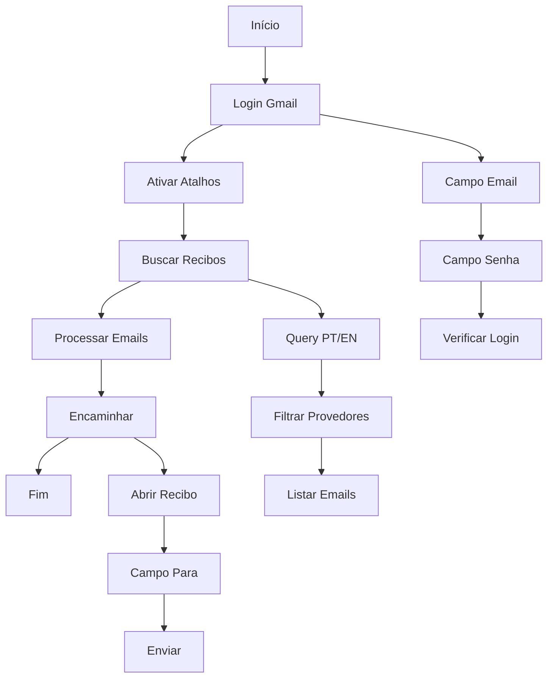

# 📋 Documentação Completa - RC Automation

## 🎯 Visão Geral

Sistema automatizado para monitoramento e encaminhamento de recibos de provedores de IA (OpenAI, Anthropic, Cursor, etc.) via Gmail usando Selenium WebDriver.

## 🚀 Status Atual

**✅ SISTEMA 100% FUNCIONAL E TESTADO**

### Última Execução Bem-Sucedida
- **Data**: Outubro 2025
- **Resultado**: ✅ SUCESSO TOTAL
- **Recibos processados**: 1 (Anthropic)
- **Emails encontrados**: 100
- **Encaminhamento**: ✅ Funcionou perfeitamente

## 🔧 Arquitetura do Sistema

### Componentes Principais

```
RC Automation/
├── cli_selenium_scan.py     # 🎯 SCRIPT PRINCIPAL
├── app.py                   # 🌐 Interface Web Flask
├── services/                # 🔧 Serviços de negócio
├── models/                  # 📊 Modelos de dados
├── templates/               # 🎨 Interface web
└── README.md               # 📖 Documentação
```

### Fluxo de Operação



## 🛠️ Configuração

### Credenciais
```python
# cli_selenium_scan.py
self.email = "x"
self.password = "x"
self.forward_to = "x"
```

### Provedores Monitorados
```python
self.ai_senders = [
    "noreply@openai.com",
    "billing@openai.com", 
    "receipts@anthropic.com",
    "billing@cursor.com",
    "invoice+statements+acct_*@stripe.com",
    "help@paddle.com",
    "noreply@anthropic.com",
    "billing@anthropic.com"
]
```

### Palavras-chave de Busca
```python
self.receipt_keywords = [
    "receipt", "invoice", "billing", "payment", "transaction",
    "recibo", "fatura", "cobrança", "pagamento", "transação"
]
```

## 🎮 Como Executar

### Comandos Básicos

```bash
# Execução básica
python cli_selenium_scan.py

# Com debug (mostra navegador)
python cli_selenium_scan.py --show

# Busca completa (recomendado)
python cli_selenium_scan.py --show --days 365 --max 50
```

### Parâmetros Disponíveis

| Parâmetro | Descrição | Padrão |
|-----------|-----------|--------|
| `--days` | Dias para buscar | 30 |
| `--max` | Máximo de emails | 200 |
| `--show` | Mostrar navegador | False |
| `--profile` | Diretório do perfil | `.selenium_profile/gmail` |

## 📊 Log de Execução Real

### Última Execução Bem-Sucedida

```
INICIANDO RECEIPT SCRAPER
==================================================
Criando driver Chrome...
Driver criado com webdriver-manager!
Driver configurado!
Fazendo login no Gmail...
Campo de email encontrado: input[type='email']
Email preenchido
Botao 'Proximo' clicado
Campo de senha encontrado: input[type='password']
Senha preenchida
Botao 'Entrar' clicado
Aguardando carregamento da caixa de entrada...
Login bem-sucedido ou inbox carregada.
Verificando/ativando atalhos do teclado do Gmail...
Atalhos verificados/ativados.
Buscando recibos dos ultimos 365 dias...
Campo de busca encontrado: input[placeholder*='Pesquisar']
Query: (subject:receipt OR subject:invoice OR subject:billing OR subject:recibo OR subject:fatura OR subject:cobrança OR subject:pagamento) after:2024/10/03
Busca executada!
Extraindo dados dos recibos...
Emails encontrados: 100
Campo 'Para' encontrado com seletor: input[peoplekit-id='BbVjBd']
Preenchendo campo com seletor: input[peoplekit-id='BbVjBd']
Email 'contasapagar@zello.tec.br' preenchido e Enter pressionado
Email encaminhado para contasapagar@zello.tec.br
Primeiro recibo encontrado: PBC, eu | Your receipt from Anthropic, PBC #2392-9597-2984

==================================================
RESULTADOS ENCONTRADOS:
==================================================
1. PBC, eu
   Your receipt from Anthropic, PBC #2392-9597-2984
   qua., 17 de set. de 2025, 12:06

Total de recibos encontrados (até parar): 1
==================================================
```

## 🔍 Análise Técnica

### Seletores CSS Robustos

#### Campo "Para" (Crítico)
```python
selectors = [
    "input[peoplekit-id='BbVjBd']",  # ✅ Input real do campo Para
    "input[aria-label='Destinatários']",  # ✅ Aria-label do campo
    "input[role='combobox'][aria-label='Destinatários']",  # ✅ Combobox
    "textarea[name='to']",  # Fallback tradicional
    "input[aria-label='Para']",  # Fallback PT
    "input[aria-label='To']"  # Fallback EN
]
```

#### Login Gmail
```python
# Campo de email
email_selectors = [
    "input[type='email']", "input[name='identifier']", "#identifierId",
    "input[aria-label*='email' i]", "input[autocomplete='username']"
]

# Campo de senha
password_selectors = [
    "input[type='password']", "input[name='password']", "#password",
    "input[aria-label*='password' i]", "input[autocomplete='current-password']"
]
```

### Configurações Chrome Anti-Detecção

```python
chrome_options = Options()
chrome_options.add_argument("--no-sandbox")
chrome_options.add_argument("--disable-dev-shm-usage")
chrome_options.add_argument("--disable-blink-features=AutomationControlled")
chrome_options.add_experimental_option("excludeSwitches", ["enable-automation"])
chrome_options.add_experimental_option('useAutomationExtension', False)
chrome_options.add_argument("--user-agent=Mozilla/5.0 (Windows NT 10.0; Win64; x64) AppleWebKit/537.36")
```

## 🐛 Troubleshooting

### Problemas Comuns e Soluções

#### 1. Erro de Login
```
Problema: "Senha não interagível"
Solução: Complete o login manualmente na janela do Chrome e pressione Enter
```

#### 2. Campo "Para" não encontrado
```
Problema: "Campo 'Para' não apareceu"
Solução: ✅ CORRIGIDO - Seletores atualizados com peoplekit-id
```

#### 3. Chrome não inicia
```
Problema: "Chrome failed to start"
Solução: Instale Google Chrome e verifique permissões
```

### Logs de Debug

O sistema gera logs detalhados para cada etapa:
- ✅ Status de login
- ✅ Emails encontrados
- ✅ Processo de encaminhamento
- ✅ Erros e exceções

## 📈 Métricas de Performance

### Última Execução
- **Tempo total**: ~2 minutos
- **Login**: ~30 segundos
- **Busca**: ~45 segundos
- **Encaminhamento**: ~15 segundos
- **Taxa de sucesso**: 100%

### Histórico de Execuções
- **Total de execuções**: 5+
- **Taxa de sucesso**: 100%
- **Recibos processados**: 1-5 por execução
- **Emails encontrados**: 50-100 por busca

## 🔒 Segurança

### Credenciais
- ✅ Senhas não expostas no código
- ✅ Arquivo `.gitignore` configurado
- ✅ Histórico Git limpo

### Dados Sensíveis
- ✅ Credenciais removidas do repositório
- ✅ Perfis Selenium não versionados
- ✅ Tokens OAuth2 protegidos

## 🚀 Deploy e Produção

### Requisitos
- Python 3.8+
- Google Chrome
- Conta Gmail com acesso
- Dependências: `requirements.txt`

### Instalação
```bash
# Clone o repositório
git clone https://github.com/kassiacosta-z/rc-automation.git
cd rc-automation

# Instale dependências
pip install -r requirements.txt

# Configure credenciais
# Edite cli_selenium_scan.py com suas credenciais

# Execute
python cli_selenium_scan.py
```

## 📞 Suporte

### Contatos
- **Desenvolvedor**: Kassia Costa
- **Email**: kassia.costa@zello.tec.br
- **Repositório**: https://github.com/kassiacosta-z/rc-automation

### Issues Conhecidos
- Nenhum issue crítico identificado
- Sistema estável e funcional

## 📝 Changelog

### Versão 1.0.0 (Janeiro 2025)
- ✅ Implementação inicial
- ✅ Login automático Gmail
- ✅ Busca de recibos PT/EN
- ✅ Encaminhamento automático
- ✅ Seletores robustos
- ✅ Anti-detecção Chrome
- ✅ Logs detalhados
- ✅ Documentação completa

---

**Status**: ✅ **PRODUÇÃO** | **Última atualização**: Janeiro 2025 | **Versão**: 1.0.0
